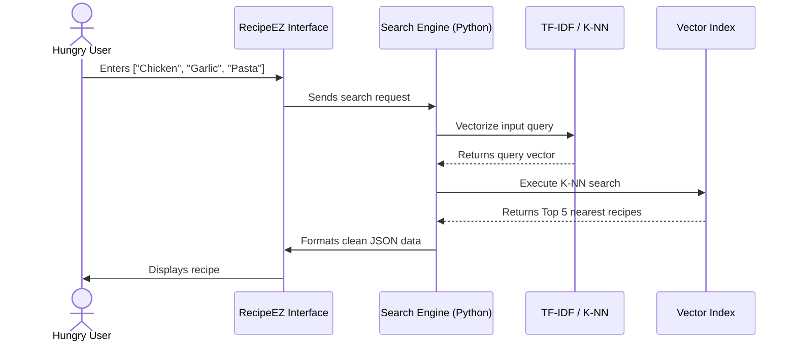

# RecipEZ Documentation

A simple recipe search engine that takes an input of ingredients
and spews out instructions and recipes.

## Table of Contents
- [The Issue](#the-issue)
- [Brainstorm and Research](#brainstorm-and-research)
- [Pipeline (TF-IDF, UMAP, K-NN)](#pipeline-tf-idf-umap-k-nn)
- [Issues and my chronological approach](#issues-and-my-chronological-approach)

## The Issue:
The main issue this project is trying to solve is the searching 
of recipes on the web. Its so stupid. So many blogs, bloat and stupid random ads and articles on the web. Im just trying to make chicken parm. You think it would be easier to find a recipe if you just looked around your pantry and inputed the ingredients you have? Yes. Yes it would. So tada~ RecipEZ is a recipe search engine that allows users to input the ingredients they have on hand and find recipes that match those ingredients. The goal is to make it easier for people to find recipes without having to sift through countless blogs and ads on the web.

## Brainstorm and Research:
1 **Declaration of Constraints**: So obviously with a big project like this you need to start with the general idea of what you are trying to accomplish. Lets start with the basics. The expected inputs are a list of individual ingredients ~ Measurements are not expected or needed. The expected output would be either a single recipe or a top list of recipes that match the input ingredients.

2 **Brainstorming solutions**: So given this, the first thing that comes to mind for me is to just slap it into some llm and have it spit out recipes based on ingredients. But thats not fun, highly expensive for such a simple problem and is really a null point. So then I thought of some way of having a relationship between the exact input ingredients and the recipes.

1. 2.0 **Clustering**: This form of relationship without exact axis meaning is clustering. If I can cluster recipes based on their ingredients and instructions, then I can find the cluster that best matches the input ingredients and return the recipes in that cluster. For clustering, this would require us to first somehow vectorize the recipes and then using ingredients to find the best cluster that best matches the vector of those recipes.
2.1 **Vectorization**: For vectorization, the initial problem is that we only have raw ingredients and we need to provide meaningful vectors in which distance equals some sort of culinary similarity.
I would sort of need to do this as if I wanted to visualize the recipes in a 2D space. Simple boolean classification would result in too close of clusters and wouldnt be as 'cool' in my opinion. Sorry very niche of me but whats the point of visualizations if they dont look cool.
2.2 **TF-IDF**: So as for the specifics of vectorization, I found out about TF-IDF (Term Frequency-Inverse Document Frequency) which is a type of techique in Natural Language Processing (NLP) that converts text into numerical vectors using the frequency of words within a document and across a section of documents. This is perfect for us and would allow me to show a relationship between commonly used ingredients in my recipe dataset.

2. **Fine-Tuned Seq2Seq**: Another method I found was using a fine-tuned Seq2Seq (Sequence-to-Sequence) model which is a type of neural network architecture commonly used for tasks like machine translation and text summarization. This could be used to generate recipes based on input ingredients, but it would require a large amount of training data and computational resources, which is why I chose TF-IDF instead.

3. **Jaccard Similarity**: Jaccard Similarity is a measure of similarity between two sets, defined as the size of the intersection divided by the size of the union of the sets. This could be used to measure the similarity between recipes based on their ingredients, but it does not take into account the frequency of ingredients or their importance in the recipe, which is why I chose TF-IDF instead. I also had a bright vision of a cool website with cool visualizations and I dont think Jaccard Similarity would be as visually appealing as TF-IDF.

3 **Visualization**: As I said earlier, my mind created the genius idea to visualize all this data live and make it interactable and for this to happen I need to find a way to represent the recipes in a space that is visually appealing and allows for quasi-relationships to be shown, likely through arbitrary clusters and axis. For this, I found UMAP (Uniform Manifold Approximation and Projection) which is a dimensionality reduction technique that can be used to visualize high-dimensional data in a lower-dimensional space. This would allow me to create a 3D visualization of the recipes based on their TF-IDF vectors, making it easier for users to explore the recipe clusters and find recipes that match their input ingredients.

4 **k-NN Searching**: Finally and likely the most important part of the project is the actual searching of recipes. Since TF-IDF already gives us an easy vectorized representaation of the recipes, this gives us the easy task of using K-NN (K-Nearest Neighbors) to find the closest recipes to the input ingredients. This would allow us to return a list of recipes that are similar to the input ingredients.

5 **Web Visualization**: For the 3D Web Visualization, I chose ThreeJS as the modern standard for web-based 3D graphics. It provides a powerful and flexible framework for creating interactive 3D visualizations in the browser, which is perfect for our use case of visualizing recipe clusters.

## Pipeline (TF-IDF, UMAP, K-NN)

### The main three components of the pipeline are:

1. **TF-IDF Vectorization**: This step converts the textual data (ingredients and instructions) into a numerical format that can be processed by machine learning algorithms. The TF-IDF (Term Frequency-Inverse Document Frequency) method is used to weigh the importance of each word in the context of the entire dataset.

2. **Dimensionality Reduction with UMAP**: After vectorization, the data is high-dimensional. UMAP (Uniform Manifold Approximation and Projection) is used to reduce the dimensionality of the data while preserving its structure, making it easier to visualize and analyze.

3. **K-NN Clustering**: This step groups similar recipes together based on their vectorized features. The K-NN (K-Nearest Neighbors) algorithm is used to identify clusters of recipes that share similar ingredients and instructions, allowing for better organization and retrieval of recipes.

### Additional Components:
- **Cosine Similarity**: This metric is used to measure the similarity between recipes based on their vectorized features. It helps in identifying how closely related two recipes are, which can be useful for recommendation systems.
- **Tag Ontology**: What I mean when I say Tag Ontology is that I have a set of tags that are associated with each recipe (e.g., "vegan", "gluten-free", "dessert") and I basically used these tags to color code and assign certain colors to each of these recipes. This allows for a more beautiful visualization within our 3D space.
- **Single Value Decomposition (SVD)**: This technique is used to further reduce the dimensionality of the data and to identify latent features during the visualization process only. This improves accuracy and performance when visualizing the data in a 3D space, as it helps to capture the most important features of the recipes while discarding noise and less relevant information. THIS DOES NOT AFFECT K-NN SEARCHING OR ACCURACY IN OUR PIPELINE.

### Visualization:
- **Plotly Express**: This library is used to create interactive visualizations of the clustered recipes. It allows for an intuitive exploration of the recipe clusters and their relationships.

## Issues and my chronological approach

1 **Data loading and parsing**: A major issue during the initial stages of the project was getting the data into a usable state. The issue
I eventually found was that most of these data sets use majorly inconsistent formats such as 3/4 cups, "chopping onions", "chopped onions", "onions, chopped", etc. This is a major discrepancy due to the fact that I need to treat ingredients as seperate features even though semantically they are equivalent.
1. **Attempts**: I made many attempts at manually cleaning the data myself. Firstly, the initial data set I planned on using was not normalized. What this means is that the ingredients were not in a consistent format. For example, measurements and certain actions would be included in the ingredient list making it significantly more difficult to parse data and vectorize the features in a manner that would give good results. As I said attempts were made but I would have had to struggle with likely some form of LLM to clean the data or making an entirely separate model just for cleaning data. 
1. **Solution**: This lead me to a separate data set that was already normalized and cleaned which made it significantly easier to parse the data and vectorize the features.

2 **Visual Tagging**: Another issue I faced was how to visually discern clusters within the space in a clean and intuitive way. As you may know converting words into vectors in 3D space is not intuitive at all, ultimately provides no meaning other than dots in space, and forces the user to interpret based off assumption of ingredients. This is not ideal and ruins the entire purpose of having a visual space for our application. Luckily, the dataset I chose had a set of tags associated with each recipe (e.g., "vegan", "gluten-free", "dessert") and I basically used these tags to color code and assign certain colors to each of these recipes. 
1. **Additional Iterations**: Numerous attempts at different color associations lead me to a form of 'oncology' color scheme where I provide meaning to certain tags and related tags to that meaning would be a similar color ~ (Note this has some subjective aspect to it as color in itself is an interpreted process and culturally associated with meaning). For example, plant based tags ("vegan", "vegetarian", "salads") would be associated with green colors, while soups and stews would be more a brown/beige color. This allowed clusters to be significantly more visually appealing to explore for the user and also provided a more intuitive way to explore the space.

3 **Front-End Visualization**: This was my biggest pain point. I have no experience using any of 3D graphics and especially not in a web environment. My clear choice for use is ThreeJS as it has extensive documentation and is the modern standard for web-based 3D graphics for web applications. However, It has a moderately decent learning curve and the importance of this aspect was the entire reason I wanted a "galaxy" theme for the project.

4 **Accuracy Testing**: I have no idea how to test the accuracy of my model. I have no idea how to test the accuracy of my K-NN searching or the accuracy of my clusters. This is a major issue as I have no way of knowing if my model is actually providing good results or if its just spitting out random recipes.

## Logs
**v1.1**: Initial data loading and parsing, basic TF-IDF vectorization, and UMAP visualization.

**v1.2**: Added color tagging based on recipe tags

**v1.3**: Experienced with researching tags and how often each showed up. Also tested out Cosine Similarity for searching.

**v1.4**: Added Web Visualization with ThreeJS, No colors are available yet but clicking recipes will show data about recipe.
