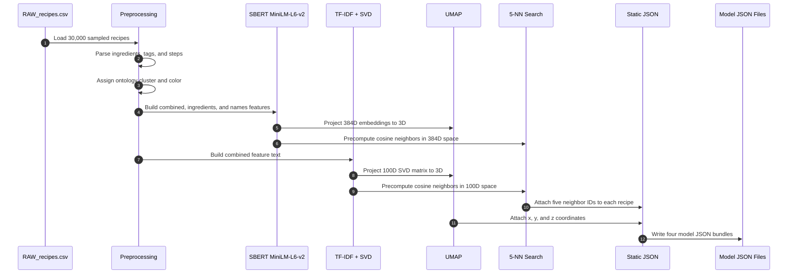
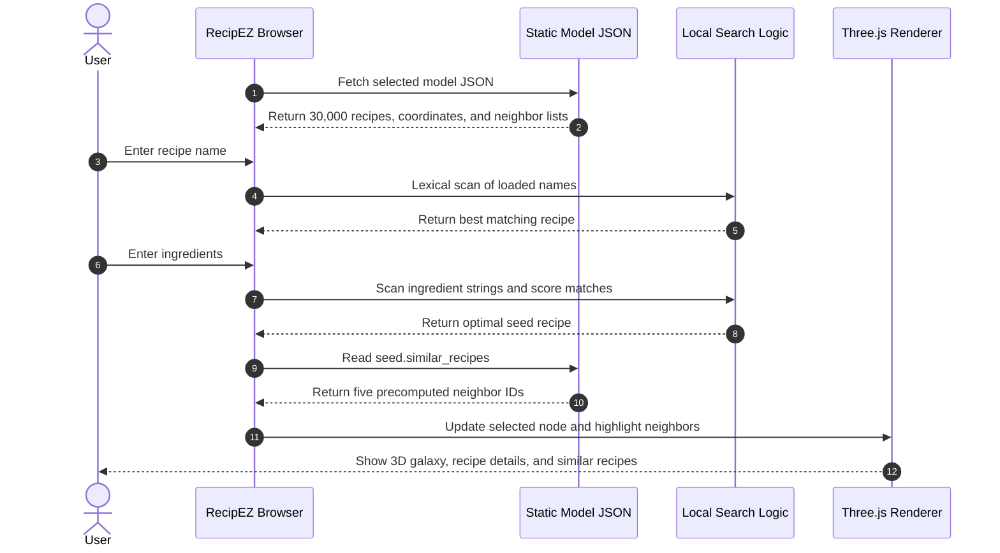

# Sequence Diagrams

RecipEZ has two separate phases. The old single-runtime diagram incorrectly implied that a Python engine and vector database were involved during a browser search. The corrected flow is split into offline model generation and static runtime lookup.

## Build-Time Pipeline

## Runtime Search

No Python, database, or vector index participates at runtime.
